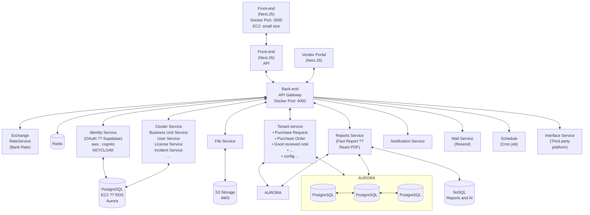

# Flowchart Diagram

Server AWS

## Server

### CloudFront

    aws service : CloudFront
    comment : Domain management, Cloud, Proxy, DDOS

### Front-end

    aws service : s3
    project type : NextJS
    next-build : SSG

### gateway

    aws service : EC2 (ECS)
    Project type : NestJS
    Concern : API Gateway Overload
    nest-build : microservice

### Elastic Load Balancing

    aws service : ELB
    comment : Load balancing, SSL termination, Proxy

### microservice

    - Microservice Authentication

        project type : NestJS
        protocol : TCP
        Port number : 5001
        nest-build : microservice

        OR

        Project type : Keyclock
        protocol : TCP
        Port number : 8080

    - Microservice Cluster

        project type : NestJS
        protocol : TCP
        Port number : 5002

    - microservice License
        project type : NestJS
        protocol : TCP
        Port number : 5003

    - Microservice File

        project type : NestJS
        protocol : TCP
        Port number : 5004

    - Microservice Notification

        project type : NestJS
        protocol : TCP
        Port number : 5005

    - Microservice Report

        project type : NestJS
        protocol : TCP
        Port number : 5007

    - Microservice Tenant Master
        project type : NestJS
        protocol : TCP
        Port number : 5008
        nest-build : microservice
        
    - Microservice Tenant Procurement
        project type : NestJS
        protocol : TCP
        Port number : 5009
        nest-build : microservice

    - Microservice Tenant Inventory
        project type : NestJS
        protocol : TCP
        Port number : 5010
        nest-build : microservice
        
    - Microservice Tenant Recipe
        project type : NestJS
        protocol : TCP
        Port number : 5011
        nest-build : microservice

### Database

    aws service : RDS OR Aurora
    project type : PostgreSQL
    Database : PostgreSQL
    schema : Multi-tenant (Schema)

