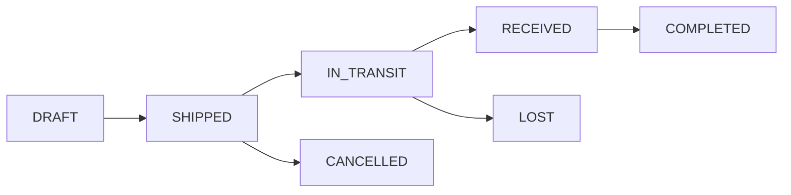

# Hotel Inventory Management System - Business Rules & Transaction Examples

## Version 1.0 - Complete Business Rules with Transaction Examples

---

## Table of Contents

1. [Core Business Rules Overview](#1-core-business-rules-overview)
2. [FIFO Costing Rules & Examples](#2-fifo-costing-rules--examples)
3. [Periodic Average Costing Rules & Examples](#3-periodic-average-costing-rules--examples)
4. [FOC (Free of Charge) Handling](#4-foc-free-of-charge-handling)
5. [Extra Cost Allocation Rules](#5-extra-cost-allocation-rules)
6. [Negative Inventory Rules](#6-negative-inventory-rules)
7. [Transfer Management Rules](#7-transfer-management-rules)
8. [Stock Take Adjustment Rules](#8-stock-take-adjustment-rules)
9. [Period Management Rules](#9-period-management-rules)
10. [Backdating Rules & Recalculation](#10-backdating-rules--recalculation)
11. [Approval Workflow Rules](#11-approval-workflow-rules)
12. [Transaction Priority & Sequencing](#12-transaction-priority--sequencing)
13. [Variance Control Rules](#13-variance-control-rules)
14. [Credit Note (Return) Rules](#14-credit-note-return-rules)
15. [Comprehensive Transaction Scenarios](#15-comprehensive-transaction-scenarios)

---

## 1. Core Business Rules Overview

### 1.1 Fundamental Principles

| Rule ID | Business Rule | Enforcement | Exception Handling |
|---------|--------------|-------------|-------------------|
| BR-001 | Each location maintains independent inventory and costing | System | No exceptions |
| BR-002 | Costing method (FIFO/AVG) is set per location, not mixed | System | No exceptions |
| BR-003 | All inventory movements require lot tracking | System | No exceptions |
| BR-004 | Negative inventory is blocked by default | System | Requires override approval |
| BR-005 | Period closure is irreversible without audit approval | System | EOP lock approval required |
| BR-006 | All costs include FOC averaging and extra costs | System | No exceptions |
| BR-007 | Backdating triggers automatic recalculation | System | No exceptions |
| BR-008 | Stock take variances > 5% require approval | Configurable | Manager override |

### 1.2 Location-Based Costing Configuration

```sql
-- Example Configuration
Location: Main Kitchen     → FIFO Costing
Location: Housekeeping     → Periodic Average
Location: F&B Storage      → FIFO Costing
Location: Engineering      → Periodic Average
```

---

## 2. FIFO Costing Rules & Examples

### 2.1 FIFO Business Rules

| Rule | Description |
|------|------------|
| FIFO-001 | Oldest inventory consumed first based on receipt date |
| FIFO-002 | Each receipt creates a new cost layer |
| FIFO-003 | Partial layer consumption is allowed |
| FIFO-004 | Depleted layers marked inactive but retained for audit |
| FIFO-005 | Cost is determined at consumption time |

### 2.2 FIFO Transaction Example

**Scenario**: Main Kitchen - Chicken Breast Inventory

#### Initial Receipts:

```
Transaction 1: GRN-2024-0001 (Jan 1, 2024)
Product: Chicken Breast
Quantity: 100 kg @ $8.00/kg = $800.00
Lot: LOT-2024-01-0001

Transaction 2: GRN-2024-0002 (Jan 5, 2024)
Product: Chicken Breast
Quantity: 150 kg @ $8.50/kg = $1,275.00
Lot: LOT-2024-01-0002

Transaction 3: GRN-2024-0003 (Jan 10, 2024)
Product: Chicken Breast
Quantity: 200 kg @ $9.00/kg = $1,800.00
FOC: 50 kg (free)
Total: 250 kg
Effective cost: $1,800 / 250 = $7.20/kg
Lot: LOT-2024-01-0003
```

#### Cost Layer Status After Receipts:

| Lot Number | Receipt Date | Available Qty | Unit Cost | Total Value | Status |
|------------|--------------|---------------|-----------|-------------|---------|
| LOT-2024-01-0001 | Jan 1 | 100 kg | $8.00 | $800.00 | ACTIVE |
| LOT-2024-01-0002 | Jan 5 | 150 kg | $8.50 | $1,275.00 | ACTIVE |
| LOT-2024-01-0003 | Jan 10 | 250 kg | $7.20 | $1,800.00 | ACTIVE |
| **TOTAL** | | **500 kg** | | **$3,875.00** | |

#### Consumption Transaction:

```
Transaction 4: SR-2024-0001 (Jan 15, 2024)
Store Requisition: 300 kg needed for banquet

FIFO Consumption:
1. From LOT-2024-01-0001: 100 kg @ $8.00 = $800.00
2. From LOT-2024-01-0002: 150 kg @ $8.50 = $1,275.00
3. From LOT-2024-01-0003: 50 kg @ $7.20 = $360.00

Total Consumed: 300 kg
Total Cost: $2,435.00
Average Cost per kg: $8.12
```

#### Cost Layer Status After Consumption:

| Lot Number | Available Qty | Unit Cost | Total Value | Status |
|------------|---------------|-----------|-------------|---------|
| LOT-2024-01-0001 | 0 kg | $8.00 | $0.00 | DEPLETED |
| LOT-2024-01-0002 | 0 kg | $8.50 | $0.00 | DEPLETED |
| LOT-2024-01-0003 | 200 kg | $7.20 | $1,440.00 | ACTIVE |
| **TOTAL** | **200 kg** | | **$1,440.00** | |

### 2.3 SQL Implementation Example

```sql
-- FIFO Consumption Calculation
WITH fifo_layers AS (
    SELECT 
        lot_no,
        available_qty,
        final_unit_cost,
        SUM(available_qty) OVER (ORDER BY layer_date, lot_no) as cumulative_qty
    FROM tb_inventory_cost_layer
    WHERE product_id = 'chicken-breast-uuid'
    AND location_id = 'main-kitchen-uuid'
    AND status = 'ACTIVE'
    ORDER BY layer_date, lot_no
),
consumption_calc AS (
    SELECT 
        lot_no,
        CASE 
            WHEN cumulative_qty - available_qty >= 300 THEN 0  -- Already consumed
            WHEN cumulative_qty > 300 THEN cumulative_qty - 300  -- Partial
            ELSE available_qty  -- Full consumption
        END as consumed_qty,
        final_unit_cost
    FROM fifo_layers
    WHERE cumulative_qty - available_qty < 300  -- Only relevant layers
)
SELECT 
    SUM(consumed_qty * final_unit_cost) as total_cost,
    SUM(consumed_qty) as total_qty,
    SUM(consumed_qty * final_unit_cost) / NULLIF(SUM(consumed_qty), 0) as avg_cost
FROM consumption_calc;
```

---

## 3. Periodic Average Costing Rules & Examples

### 3.1 Periodic Average Business Rules

| Rule | Description |
|------|------------|
| AVG-001 | Average cost calculated at period end only |
| AVG-002 | All issues during period use the same average cost |
| AVG-003 | Average = (Opening Value + Receipts Value) / (Opening Qty + Receipts Qty) |
| AVG-004 | Cost assigned to issues retroactively at period close |
| AVG-005 | No cost changes allowed after period finalization |

### 3.2 Periodic Average Transaction Example

**Scenario**: Housekeeping Store - Shampoo Bottles (January 2024)

#### Opening Balance (from December 2023):
```
Opening Quantity: 500 bottles
Opening Value: $1,000.00
Opening Average: $2.00/bottle
```

#### January Transactions:

```
Receipt 1: GRN-2024-0010 (Jan 5)
Quantity: 1,000 bottles @ $2.20/bottle = $2,200.00

Receipt 2: GRN-2024-0015 (Jan 15)
Quantity: 800 bottles @ $2.50/bottle = $2,000.00
FOC: 200 bottles
Total: 1,000 bottles
Effective Value: $2,000.00

Receipt 3: GRN-2024-0020 (Jan 25)
Quantity: 500 bottles @ $2.30/bottle = $1,150.00
```

#### Period Average Calculation:

```
Available for Averaging:
- Opening: 500 bottles @ $1,000.00
- Receipts: 2,500 bottles @ $5,350.00
- Total: 3,000 bottles @ $6,350.00

Period Average Cost = $6,350.00 / 3,000 = $2.117/bottle
```

#### January Issues (all at period average):

```
Issue 1: SR-2024-0100 (Jan 8)
Quantity: 300 bottles
Cost: 300 × $2.117 = $635.00

Issue 2: SR-2024-0101 (Jan 18)
Quantity: 500 bottles
Cost: 500 × $2.117 = $1,058.33

Issue 3: SR-2024-0102 (Jan 28)
Quantity: 400 bottles
Cost: 400 × $2.117 = $846.67

Total Issues: 1,200 bottles @ $2,540.00
```

#### Closing Balance:

```
Closing Quantity = 3,000 - 1,200 = 1,800 bottles
Closing Value = 1,800 × $2.117 = $3,810.00
Closing Average = $2.117/bottle

This becomes February's opening balance
```

### 3.3 Period-End Processing SQL

```sql
-- Calculate Period Average
DECLARE
    v_opening_qty DECIMAL := 500;
    v_opening_value DECIMAL := 1000.00;
    v_receipt_qty DECIMAL;
    v_receipt_value DECIMAL;
    v_period_avg DECIMAL;
BEGIN
    -- Get total receipts
    SELECT 
        SUM(total_qty),
        SUM(total_layer_cost)
    INTO v_receipt_qty, v_receipt_value
    FROM tb_inventory_cost_layer
    WHERE product_id = 'shampoo-uuid'
    AND location_id = 'housekeeping-uuid'
    AND DATE_TRUNC('month', layer_date) = '2024-01-01';
    
    -- Calculate average
    v_period_avg := (v_opening_value + v_receipt_value) / 
                    (v_opening_qty + v_receipt_qty);
    
    -- Update all issues with average cost
    UPDATE tb_inventory_transaction_detail itd
    SET 
        cost_per_unit = v_period_avg,
        total_cost = qty * v_period_avg
    FROM tb_inventory_transaction it
    WHERE it.id = itd.inventory_transaction_id
    AND it.inventory_doc_type IN ('store_requisition', 'stock_out')
    AND DATE_TRUNC('month', it.created_at) = '2024-01-01'
    AND itd.product_id = 'shampoo-uuid'
    AND itd.location_id = 'housekeeping-uuid';
END;
```

---

## 4. FOC (Free of Charge) Handling

### 4.1 FOC Business Rules

| Rule | Description |
|------|------------|
| FOC-001 | FOC quantities are averaged into the batch cost |
| FOC-002 | FOC items do not create separate zero-cost layers |
| FOC-003 | Effective unit cost = Total Paid Amount / (Paid Qty + FOC Qty) |
| FOC-004 | FOC quantities affect inventory quantity but not purchase value |

### 4.2 FOC Transaction Example

**Scenario**: Purchase with FOC Items

```
GRN-2024-0030 (Jan 20, 2024)
Vendor: ABC Supplies
```

#### Line Item 1: Toilet Paper
```
Purchased: 1,000 rolls @ $0.50/roll = $500.00
FOC: 200 rolls (20% bonus)
Total Quantity: 1,200 rolls

Cost Calculation:
- Line Amount: $500.00
- Total Quantity: 1,200 rolls
- Effective Unit Cost: $500.00 / 1,200 = $0.417/roll

Result: 1,200 rolls at $0.417/roll (not 1,000 @ $0.50 + 200 @ $0.00)
```

#### Line Item 2: Hand Soap
```
Purchased: 500 bottles @ $3.00/bottle = $1,500.00
FOC: 100 bottles (buy 5 get 1 free)
Total Quantity: 600 bottles

Cost Calculation:
- Line Amount: $1,500.00
- Total Quantity: 600 bottles
- Effective Unit Cost: $1,500.00 / 600 = $2.50/bottle
```

#### With Extra Costs Applied:
```
Total GRN Value: $2,000.00
Freight Cost: $100.00
Insurance: $50.00
Total Extra: $150.00

Allocation by Value:
- Toilet Paper: 25% of value = $37.50 extra
  Final cost: ($500 + $37.50) / 1,200 = $0.448/roll
  
- Hand Soap: 75% of value = $112.50 extra
  Final cost: ($1,500 + $112.50) / 600 = $2.688/bottle
```

---

## 5. Extra Cost Allocation Rules

### 5.1 Extra Cost Business Rules

| Rule | Description |
|------|------------|
| EXTRA-001 | Extra costs allocated proportionally by value |
| EXTRA-002 | Allocation happens after FOC calculation |
| EXTRA-003 | Extra costs become part of inventory value |
| EXTRA-004 | Cannot allocate negative extra costs |

### 5.2 Extra Cost Allocation Example

**Scenario**: Import shipment with multiple charges

```
GRN-2024-0040 (Feb 1, 2024)
Vendor: International Foods
```

#### Products:
```
1. Olive Oil: 100 bottles @ $10/bottle = $1,000 (20% of total)
2. Pasta: 500 packs @ $2/pack = $1,000 (20% of total)
3. Wine: 50 bottles @ $30/bottle = $1,500 (30% of total)
4. Cheese: 100 kg @ $15/kg = $1,500 (30% of total)

Subtotal: $5,000
```

#### Extra Costs:
```
Ocean Freight: $800
Customs Duty: $500
Port Handling: $200
Insurance: $100
Total Extra: $1,600
```

#### Allocation Calculation:

| Product | Base Value | % of Total | Allocated Extra | Final Cost | Unit Cost |
|---------|------------|------------|-----------------|------------|-----------|
| Olive Oil | $1,000 | 20% | $320 | $1,320 | $13.20/bottle |
| Pasta | $1,000 | 20% | $320 | $1,320 | $2.64/pack |
| Wine | $1,500 | 30% | $480 | $1,980 | $39.60/bottle |
| Cheese | $1,500 | 30% | $480 | $1,980 | $19.80/kg |
| **TOTAL** | **$5,000** | **100%** | **$1,600** | **$6,600** | |

### 5.3 SQL Implementation

```sql
-- Allocate extra costs
WITH grn_values AS (
    SELECT 
        id,
        product_id,
        (received_qty + COALESCE(foc_qty, 0)) * price as line_value,
        SUM((received_qty + COALESCE(foc_qty, 0)) * price) 
            OVER (PARTITION BY good_received_note_id) as total_value
    FROM tb_good_received_note_detail
    WHERE good_received_note_id = 'grn-uuid'
),
extra_costs AS (
    SELECT SUM(cost_amount) as total_extra
    FROM tb_grn_extra_cost
    WHERE grn_id = 'grn-uuid'
)
UPDATE tb_inventory_cost_layer cl
SET 
    allocated_extra_cost = (gv.line_value / gv.total_value) * ec.total_extra,
    total_layer_cost = line_amount + ((gv.line_value / gv.total_value) * ec.total_extra),
    final_unit_cost = (line_amount + ((gv.line_value / gv.total_value) * ec.total_extra)) / total_qty
FROM grn_values gv, extra_costs ec
WHERE cl.grn_detail_id = gv.id;
```

---

## 6. Negative Inventory Rules

### 6.1 Negative Inventory Business Rules

| Rule | Description |
|------|------------|
| NEG-001 | Negative inventory blocked by default |
| NEG-002 | Override requires management approval with reason |
| NEG-003 | Provisional cost assigned using last known cost |
| NEG-004 | Automatic true-up when stock arrives |
| NEG-005 | Maximum negative period: 24 hours (configurable) |
| NEG-006 | Cost variance posted to adjustment account |

### 6.2 Negative Inventory Example

**Scenario**: Emergency requisition exceeds available stock

```
Product: Cleaning Bleach
Location: Housekeeping
Available: 20 liters
```

#### Transaction Attempt:

```
SR-2024-0200 (Feb 10, 2024 14:00)
Requested: 50 liters
Available: 20 liters
Shortage: 30 liters

System Response: BLOCKED
Reason: Insufficient inventory (need 30 liters more)
```

#### Override Approval:

```
Override Request #OR-2024-001
Requested By: Housekeeping Supervisor
Reason: Emergency cleaning for VIP arrival
Approved By: Hotel Manager
Approval Time: Feb 10, 2024 14:15
Max Negative: 30 liters
Max Duration: 24 hours
```

#### Processing with Override:

```
Consumption:
1. Physical inventory: 20 liters @ $5.00/liter = $100.00
2. Negative inventory: 30 liters @ $5.00/liter = $150.00 (provisional)

Total Cost Assigned: $250.00
Status: 30 liters negative
```

#### Resolution (when stock arrives):

```
GRN-2024-0050 (Feb 10, 2024 18:00)
Received: 100 liters @ $5.50/liter = $550.00

Resolution Process:
1. Cover negative: 30 liters @ $5.50 = $165.00
2. Cost adjustment: $165.00 - $150.00 = $15.00 variance
3. Remaining stock: 70 liters @ $5.50/liter

Variance Posted:
- Original provisional: $150.00
- Actual cost: $165.00
- Variance: $15.00 (posted to cost adjustment account)
```

### 6.3 Negative Inventory Monitoring

```sql
-- Monitor negative inventory
CREATE VIEW v_negative_inventory_alert AS
SELECT 
    p.name as product_name,
    l.name as location_name,
    ni.negative_qty,
    ni.provisional_total_cost,
    ni.went_negative_at,
    EXTRACT(HOUR FROM NOW() - ni.went_negative_at) as hours_negative,
    CASE 
        WHEN NOW() - ni.went_negative_at > INTERVAL '24 hours' THEN 'CRITICAL'
        WHEN NOW() - ni.went_negative_at > INTERVAL '12 hours' THEN 'WARNING'
        ELSE 'MONITORING'
    END as alert_level
FROM tb_negative_inventory ni
JOIN tb_product p ON ni.product_id = p.id
JOIN tb_location l ON ni.location_id = l.id
WHERE ni.status = 'OPEN'
ORDER BY ni.went_negative_at;
```

---

## 7. Transfer Management Rules

### 7.1 Transfer Business Rules

| Rule | Description |
|------|------------|
| TRANS-001 | Transfers move inventory at actual cost |
| TRANS-002 | Source location must have sufficient inventory |
| TRANS-003 | In-transit inventory tracked separately |
| TRANS-004 | Variance between shipped and received requires approval |
| TRANS-005 | Cost basis maintained from source location |

### 7.2 Transfer Transaction Example

**Scenario**: Transfer from Central Store to Kitchen

```
Transfer #TRF-2024-0001 (Feb 15, 2024)
From: Central Store (FIFO)
To: Main Kitchen (FIFO)
```

#### Transfer Details:

```
Product: Cooking Oil
Requested: 50 liters
```

#### Source Location Inventory (Central Store):

| Lot | Available | Cost/Liter |
|-----|-----------|------------|
| LOT-2024-01-0010 | 20 L | $4.00 |
| LOT-2024-01-0011 | 25 L | $4.20 |
| LOT-2024-01-0012 | 30 L | $4.50 |

#### Shipment (FIFO Consumption):

```
Shipped: 50 liters
Consumption:
1. LOT-2024-01-0010: 20 L @ $4.00 = $80.00
2. LOT-2024-01-0011: 25 L @ $4.20 = $105.00
3. LOT-2024-01-0012: 5 L @ $4.50 = $22.50

Total Cost: $207.50
Average Cost: $4.15/liter
Status: IN_TRANSIT
```

#### Receipt at Destination:

```
Received: 48 liters (2 liters damaged in transit)
New Lot at Kitchen: LOT-2024-02-0001

Cost Assignment:
- Transferred Cost: $207.50
- Received Quantity: 48 liters
- Final Unit Cost: $207.50 / 48 = $4.32/liter

Variance:
- Expected: 50 liters
- Received: 48 liters
- Variance: 2 liters @ $4.15 = $8.30 (written off)
```

### 7.3 Transfer Status Workflow



---

## 8. Stock Take Adjustment Rules

### 8.1 Stock Take Business Rules

| Rule | Description |
|------|------------|
| STOCK-001 | Physical count overrides system quantity |
| STOCK-002 | Variance > 5% requires approval |
| STOCK-003 | Adjustment creates stock in/out transaction |
| STOCK-004 | Cost assigned based on location method |
| STOCK-005 | Spot checks allowed without full count |

### 8.2 Stock Take Example

**Scenario**: Monthly stock take at Main Kitchen

```
Stock Take #STK-2024-01-001 (Jan 31, 2024)
Location: Main Kitchen
Type: Full Physical Count
```

#### Count Results:

| Product | System Qty | Physical Qty | Variance | % Variance | Action |
|---------|------------|--------------|----------|------------|---------|
| Chicken Breast | 200 kg | 195 kg | -5 kg | -2.5% | Auto-adjust |
| Beef Tenderloin | 50 kg | 48 kg | -2 kg | -4% | Auto-adjust |
| Salmon Fillet | 30 kg | 25 kg | -5 kg | -16.7% | **Requires Approval** |
| Rice | 100 kg | 102 kg | +2 kg | +2% | Auto-adjust |
| Cooking Oil | 75 L | 90 L | +15 L | +20% | **Requires Approval** |

#### Variance Analysis for Salmon:

```
System Quantity: 30 kg
Physical Count: 25 kg
Variance: -5 kg (-16.7%)
Threshold: 5%
Status: REQUIRES APPROVAL

Investigation Notes:
- 3 kg used for staff meal (not recorded)
- 2 kg spoilage (not reported)
Approved By: F&B Manager
Approval Time: Jan 31, 2024 18:00
```

#### Adjustment Entries:

```sql
-- For shortage (Salmon)
INSERT INTO tb_inventory_transaction (inventory_doc_type, inventory_doc_no)
VALUES ('stock_out', 'STK-ADJ-2024-01-001');

INSERT INTO tb_inventory_transaction_detail (
    inventory_transaction_id,
    product_id,
    location_id,
    qty,
    cost_per_unit,
    total_cost
) VALUES (
    'txn-uuid',
    'salmon-uuid',
    'kitchen-uuid',
    5,  -- shortage quantity
    45.00,  -- current FIFO cost
    225.00
);

-- For overage (Cooking Oil)
INSERT INTO tb_inventory_transaction (inventory_doc_type, inventory_doc_no)
VALUES ('stock_in', 'STK-ADJ-2024-01-002');

-- Overage uses last known cost
INSERT INTO tb_inventory_transaction_detail (
    inventory_transaction_id,
    product_id,
    location_id,
    qty,
    cost_per_unit,
    total_cost
) VALUES (
    'txn-uuid',
    'oil-uuid',
    'kitchen-uuid',
    15,  -- overage quantity
    4.15,  -- last known cost
    62.25
);
```

---

## 9. Period Management Rules

### 9.1 Period Business Rules

| Rule | Description |
|------|------------|
| PERIOD-001 | Periods follow calendar months |
| PERIOD-002 | Each location can close independently |
| PERIOD-003 | Soft close allows 3-5 days for adjustments |
| PERIOD-004 | No backdating to locked periods |
| PERIOD-005 | Cost changes prohibited after closure |

### 9.2 Period Closing Example

**Scenario**: January 2024 Month-End Close

#### Timeline:

```
Jan 31, 2024 (Day 0) - Last operational day
├── 23:59 - Last transaction cutoff
└── 24:00 - February period opens

Feb 1-3, 2024 - Soft Close Window
├── Feb 1 - Initial reconciliation
├── Feb 2 - Corrections and adjustments
└── Feb 3 - Final approval

Feb 4, 2024 - Hard Close
├── 00:00 - January period closed
├── Average costs calculated (AVG locations)
└── Reports generated

Feb 15, 2024 - Audit Lock
└── Period locked after audit review
```

#### Soft Close Activities:

```sql
-- Day 1: Check pending transactions
SELECT 
    COUNT(*) as pending_count,
    STRING_AGG(document_no, ', ') as pending_docs
FROM tb_inventory_transaction
WHERE DATE(created_at) BETWEEN '2024-01-01' AND '2024-01-31'
AND status != 'COMPLETED';

-- Day 2: Process late GRNs
-- GRN dated Jan 30 but entered Feb 1
INSERT INTO tb_good_received_note (
    grn_no, 
    grn_date,  -- Backdated
    created_at  -- Actual entry
) VALUES (
    'GRN-2024-0199',
    '2024-01-30 15:00:00',  -- Within period
    '2024-02-01 09:00:00'   -- During soft close
);

-- Day 3: Calculate average costs
SELECT calculate_period_average_cost('jan-2024-period-uuid', 'housekeeping-uuid');
```

---

## 10. Backdating Rules & Recalculation

### 10.1 Backdating Business Rules

| Rule | Description |
|------|------------|
| BACK-001 | Backdating allowed to open/soft-closed periods only |
| BACK-002 | Triggers automatic recalculation from transaction date |
| BACK-003 | Current month: immediate recalculation |
| BACK-004 | Previous months: batch recalculation |
| BACK-005 | Cost changes tracked in audit log |

### 10.2 Backdating Example

**Scenario**: Late GRN entry affecting FIFO costs

```
Current Date: Feb 15, 2024
Backdated Transaction: GRN for Jan 20, 2024
```

#### Original Timeline (before backdating):

```
Jan 15: GRN-001 → 100 units @ $10 = $1,000
Jan 18: SR-001 → Consumed 80 units @ $10 = $800
Jan 22: GRN-002 → 50 units @ $12 = $600
Jan 25: SR-002 → Consumed 60 units
         ├── 20 @ $10 = $200 (remaining from GRN-001)
         └── 40 @ $12 = $480 (from GRN-002)
         Total: $680
```

#### Backdated Entry:

```
Jan 20: GRN-003 (BACKDATED) → 75 units @ $9 = $675
```

#### Recalculated Timeline:

```
Jan 15: GRN-001 → 100 units @ $10 = $1,000
Jan 18: SR-001 → 80 units @ $10 = $800 (NO CHANGE)
Jan 20: GRN-003 → 75 units @ $9 = $675 (NEW)
Jan 22: GRN-002 → 50 units @ $12 = $600
Jan 25: SR-002 → 60 units (RECALCULATED)
         ├── 20 @ $10 = $200 (from GRN-001)
         └── 40 @ $9 = $360 (from GRN-003) ← CHANGED
         Total: $560 (was $680)
```

#### Impact Summary:

```sql
-- Cost change log
INSERT INTO tb_cost_change_log (
    transaction_id,
    old_cost,
    new_cost,
    cost_difference,
    triggered_by,
    backdate_control_id
) VALUES (
    'SR-002-uuid',
    680.00,
    560.00,
    -120.00,
    'BACKDATE',
    'backdate-control-uuid'
);

-- Notification
Cost Impact Report:
- Transaction: SR-002
- Original Cost: $680.00
- Recalculated Cost: $560.00
- Savings: $120.00
- Affected Period: January 2024
- Recalculation Time: 2.3 seconds
```

---

## 11. Approval Workflow Rules

### 11.1 Approval Business Rules

| Rule | Description |
|------|------------|
| APPR-001 | Approval required based on threshold configuration |
| APPR-002 | Escalation if not approved within SLA |
| APPR-003 | Approval delegation allowed with audit trail |
| APPR-004 | Bulk approval permitted for same approval type |

### 11.2 Approval Scenarios

#### Scenario 1: Stock Take Variance Approval

```
Threshold Configuration:
- Auto-approve: ≤ 5% variance
- Supervisor: 5-10% variance
- Manager: 10-20% variance
- Director: > 20% variance

Transaction:
Product: Lobster
System: 20 kg
Physical: 15 kg
Variance: -5 kg (25%)
Required Approval: Director

Workflow:
1. System creates approval request
2. Notification to Director
3. If no response in 4 hours → Escalate to GM
4. Approval/Rejection with notes
5. Adjustment processed or cancelled
```

#### Scenario 2: Negative Inventory Override

```sql
-- Approval request creation
INSERT INTO tb_approval_request (
    request_type,
    entity_type,
    entity_id,
    requested_by_id,
    approval_level_required,
    details,
    expires_at
) VALUES (
    'NEGATIVE_INVENTORY',
    'store_requisition',
    'SR-2024-0300',
    'user-uuid',
    'MANAGER',
    jsonb_build_object(
        'product', 'Champagne',
        'requested_qty', 12,
        'available_qty', 8,
        'shortage', 4,
        'reason', 'VIP event tonight'
    ),
    NOW() + INTERVAL '2 hours'
);

-- Approval processing
UPDATE tb_approval_request
SET 
    status = 'APPROVED',
    approved_by_id = 'manager-uuid',
    approved_at = NOW(),
    approval_notes = 'Approved for VIP event. Ensure reorder tomorrow.'
WHERE id = 'approval-request-uuid';
```

---

## 12. Transaction Priority & Sequencing

### 12.1 Priority Rules

| Priority | Transaction Type | Description |
|----------|-----------------|-------------|
| 100 | Stock Take | Highest - establishes correct quantities |
| 200 | Stock In | Positive adjustments |
| 201 | GRN | Regular receipts |
| 202 | Transfer In | Incoming transfers |
| 300 | Transfer Out | Outgoing transfers |
| 301 | Credit Note | Returns to vendor |
| 302 | Store Requisition | Normal consumption |
| 303 | Stock Out | Negative adjustments |

### 12.2 Same-Day Transaction Example

**Scenario**: Multiple transactions on Feb 20, 2024

```
Transactions (order received):
1. 09:00 - SR-001: Request 50 units
2. 10:00 - GRN-001: Receive 100 units
3. 11:00 - STK-001: Stock count shows 145 units
4. 14:00 - SR-002: Request 30 units
5. 15:00 - Transfer-001: Send 20 units
```

#### System Processing Order:

```
1. STK-001 (Priority 100): Establish base quantity = 145 units
2. GRN-001 (Priority 201): Add 100 units = 245 units
3. Transfer-001 (Priority 300): Remove 20 units = 225 units
4. SR-001 (Priority 302): Remove 50 units = 175 units
5. SR-002 (Priority 302): Remove 30 units = 145 units

Note: SR-001 and SR-002 processed by timestamp since same priority
```

---

## 13. Variance Control Rules

### 13.1 Variance Threshold Configuration

| Location Type | Product Category | Qty Variance | Value Variance | Approval Level |
|--------------|-----------------|--------------|----------------|----------------|
| Kitchen | Proteins | 5% | $500 | Supervisor |
| Kitchen | Dry Goods | 10% | $200 | Auto |
| Bar | Spirits | 2% | $1000 | Manager |
| Housekeeping | Supplies | 15% | $300 | Supervisor |
| Engineering | Parts | 5% | $2000 | Manager |

### 13.2 Variance Calculation Example

```sql
-- Variance analysis for stock take
WITH variance_calc AS (
    SELECT 
        st.product_id,
        p.name as product_name,
        icl.current_avg_cost,
        st.system_qty,
        st.physical_qty,
        st.physical_qty - st.system_qty as variance_qty,
        ROUND(((st.physical_qty - st.system_qty) / NULLIF(st.system_qty, 0)) * 100, 2) as variance_pct,
        (st.physical_qty - st.system_qty) * icl.current_avg_cost as variance_value
    FROM tb_stock_take_detail st
    JOIN tb_product p ON st.product_id = p.id
    JOIN (
        SELECT 
            product_id,
            AVG(final_unit_cost) as current_avg_cost
        FROM tb_inventory_cost_layer
        WHERE status = 'ACTIVE'
        GROUP BY product_id
    ) icl ON icl.product_id = st.product_id
    WHERE st.stock_take_id = 'stk-uuid'
)
SELECT 
    *,
    CASE 
        WHEN ABS(variance_pct) <= 5 THEN 'AUTO_APPROVE'
        WHEN ABS(variance_pct) <= 10 THEN 'SUPERVISOR'
        WHEN ABS(variance_pct) <= 20 THEN 'MANAGER'
        ELSE 'DIRECTOR'
    END as required_approval
FROM variance_calc
ORDER BY ABS(variance_value) DESC;
```

---

## 14. Credit Note (Return) Rules

### 14.1 Credit Note Business Rules

| Rule | Description |
|------|------------|
| CN-001 | Returns create positive inventory adjustment |
| CN-002 | Original cost used if traceable to specific GRN |
| CN-003 | Period average used if cost not traceable |
| CN-004 | Quality issues require photo documentation |
| CN-005 | Credit notes affect period cost calculations |

### 14.2 Credit Note Example

**Scenario**: Return of damaged goods

```
Original GRN: GRN-2024-0100 (Feb 1, 2024)
Product: Wine Glasses
Received: 144 pieces @ $5.00 = $720.00
Lot: LOT-2024-02-0100
```

#### Return Transaction:

```
Credit Note: CN-2024-0010 (Feb 25, 2024)
Reason: 24 pieces damaged (broken in storage)
```

#### Cost Assignment Options:

##### Option 1: Traceable to Original GRN
```
Return Quantity: 24 pieces
Original Cost: $5.00/piece
Return Value: $120.00
New Lot: LOT-2024-02-0200 (negative adjustment)

Inventory Impact:
- Original Layer: 144 pieces reduced to 120 pieces
- Value adjusted: $720 - $120 = $600
```

##### Option 2: Period Average (if not traceable)
```
Current Period Average: $5.25/piece
Return Value: 24 × $5.25 = $126.00

Cost Variance: $126 - $120 = $6.00 (absorbed in period)
```

---

## 15. Comprehensive Transaction Scenarios

### 15.1 Complete Monthly Cycle Example

**Hotel**: Paradise Resort (250 rooms)
**Month**: January 2024
**Location**: Main Kitchen (FIFO)

#### Week 1 Transactions:

```
Jan 2: Opening Balance
- Chicken: 50 kg @ $8.00/kg
- Beef: 30 kg @ $25.00/kg
- Rice: 100 kg @ $2.00/kg

Jan 3: GRN-001
- Chicken: 200 kg @ $8.50/kg = $1,700
- FOC: 25 kg
- Total: 225 kg, Effective: $7.56/kg

Jan 4: SR-001 (Lunch Service)
- Chicken: 60 kg
  └── 50 kg @ $8.00 = $400
  └── 10 kg @ $7.56 = $75.56
  Total: $475.56

Jan 5: Emergency Transfer IN
- Rice: 50 kg @ $2.10/kg from Store
```

#### Cost Layer Evolution:

| Date | Transaction | Chicken Layers | Total Value |
|------|------------|---------------|-------------|
| Jan 2 | Opening | 50kg @ $8.00 | $400 |
| Jan 3 | GRN-001 | 50kg @ $8.00<br>225kg @ $7.56 | $2,100 |
| Jan 4 | SR-001 | 0kg @ $8.00<br>215kg @ $7.56 | $1,624.44 |
| Jan 5 | - | No change | $1,624.44 |

#### Week 2-4 Summary:

```
Total Receipts: 15 GRNs
Total Issues: 85 Store Requisitions
Stock Takes: 2 (mid-month spot check, month-end full)
Transfers: 5 IN, 3 OUT
Credit Notes: 1 (damaged vegetables)
Adjustments: 3 (spillage, spoilage)
```

#### Month-End Processing:

```sql
-- January 31, 2024 End of Day
BEGIN TRANSACTION;

-- 1. Complete pending transactions
UPDATE tb_inventory_transaction
SET status = 'COMPLETED'
WHERE DATE(created_at) <= '2024-01-31'
AND status = 'PENDING';

-- 2. Process final stock take
SELECT process_stock_take_with_variance('STK-2024-01-31');

-- 3. Calculate FIFO costs
SELECT finalize_fifo_costs('2024-01-01', '2024-01-31', 'main-kitchen-uuid');

-- 4. Generate cost report
INSERT INTO tb_monthly_cost_summary
SELECT 
    'main-kitchen-uuid',
    '2024-01',
    SUM(CASE WHEN doc_type = 'GRN' THEN total_cost ELSE 0 END) as total_purchases,
    SUM(CASE WHEN doc_type = 'SR' THEN total_cost ELSE 0 END) as total_consumption,
    SUM(available_qty * final_unit_cost) as closing_inventory_value
FROM tb_inventory_cost_layer
WHERE location_id = 'main-kitchen-uuid';

COMMIT;

-- 5. Soft close period
SELECT soft_close_period('jan-2024-period', 'main-kitchen-uuid', 'user-uuid');
```

### 15.2 Complex Scenario: Multi-Location with Mixed Costing

**Scenario**: Hotel-wide champagne requisition for New Year's Eve

```
Locations:
- Central Store: 50 bottles (FIFO)
- F&B Store: 30 bottles (AVG)
- Banquet Store: 20 bottles (FIFO)
Need: 150 bottles for event
```

#### Inventory Check:

```sql
-- Check available inventory
SELECT 
    l.name as location,
    l.costing_method,
    SUM(icl.available_qty) as available,
    AVG(icl.final_unit_cost) as avg_cost
FROM tb_inventory_cost_layer icl
JOIN tb_location l ON icl.location_id = l.id
WHERE icl.product_id = 'champagne-uuid'
AND icl.status = 'ACTIVE'
GROUP BY l.name, l.costing_method;

Result:
Central Store  | FIFO | 50  | $45.00
F&B Store     | AVG  | 30  | $43.50
Banquet Store | FIFO | 20  | $46.00
Total: 100 bottles (need 50 more)
```

#### Solution Process:

```
1. Issue from all locations (100 bottles)
2. Emergency purchase (50 bottles)
3. Direct delivery to event

Transactions:
- SR-001: 50 from Central @ FIFO cost = $2,250
- SR-002: 30 from F&B @ $43.50 = $1,305
- SR-003: 20 from Banquet @ FIFO = $920
- GRN-001: 50 emergency @ $50 = $2,500
- Direct Issue: 50 @ $50 = $2,500

Total Event Cost: $9,475
Average Cost per Bottle: $63.17
```

### 15.3 Year-End Scenario with Audit Adjustments

**Scenario**: December 31, 2024 Year-End Close with Audit

```
Discoveries during audit (January 15, 2025):
1. Unrecorded GRN from December 28
2. Mathematical error in stock take
3. Transfer recorded to wrong location
```

#### Required Corrections:

```sql
-- Since December is LOCKED, need special approval
INSERT INTO tb_audit_adjustment_request (
    period_id,
    adjustment_type,
    details,
    impact_assessment,
    requested_by
) VALUES (
    'dec-2024-period',
    'MULTIPLE_CORRECTIONS',
    jsonb_build_object(
        'grn_missing', 'GRN-2024-1299',
        'stock_error', 'STK-2024-12-31',
        'transfer_error', 'TRF-2024-0899'
    ),
    jsonb_build_object(
        'inventory_impact', 5420.00,
        'cogs_impact', -3200.00
    ),
    'external-auditor-uuid'
);

-- After approval, special adjustment posted
SELECT execute_audit_adjustment('adjustment-request-uuid', 'cfo-approval-token');
```

---

## Business Rules Validation Matrix

### Validation Checkpoints

| Checkpoint | Rule | Validation Query | Expected Result |
|------------|------|------------------|-----------------|
| Daily Close | No negative inventory | `SELECT COUNT(*) FROM tb_negative_inventory WHERE status = 'OPEN'` | 0 |
| Period Close | All transactions complete | `SELECT COUNT(*) FROM tb_transaction_sequence WHERE processed = FALSE` | 0 |
| Stock Take | Variance threshold | `SELECT COUNT(*) FROM tb_stock_take_approval WHERE status = 'PENDING'` | 0 |
| Month End | Cost integrity | `SELECT * FROM validate_cost_integrity()` | ALL PASS |
| Audit | No unauthorized changes | `SELECT COUNT(*) FROM tb_audit_log WHERE period_locked = TRUE` | 0 |

---

## Appendix: Quick Reference Tables

### A.1 Document Number Formats

| Document Type | Format | Example |
|--------------|--------|---------|
| GRN | GRN-YYYY-NNNN | GRN-2024-0001 |
| Store Requisition | SR-YYYY-NNNN | SR-2024-0001 |
| Transfer | TRF-YYYY-NNNN | TRF-2024-0001 |
| Credit Note | CN-YYYY-NNNN | CN-2024-0001 |
| Stock Take | STK-YYYY-MM-NNN | STK-2024-01-001 |
| Adjustment | ADJ-YYYY-NNNN | ADJ-2024-0001 |

### A.2 Status Codes

| Entity | Status Options |
|--------|---------------|
| Period | OPEN, SOFT_CLOSED, CLOSED, LOCKED |
| Transaction | DRAFT, PENDING, COMPLETED, CANCELLED |
| Transfer | DRAFT, SHIPPED, IN_TRANSIT, RECEIVED, COMPLETED |
| Approval | PENDING, APPROVED, REJECTED, EXPIRED |
| Inventory Layer | ACTIVE, DEPLETED |

### A.3 Cost Method Summary

| Method | When Cost Assigned | Cost Basis | Recalculation |
|--------|-------------------|------------|---------------|
| FIFO | At consumption | Actual layers | If backdated |
| Average | At period end | Period average | End of period |

---

## Conclusion

These business rules and transaction examples provide a comprehensive guide for implementing and operating the hotel inventory management system. The rules ensure:

1. **Consistency** - Same rules applied across all locations
2. **Accuracy** - Precise cost tracking with audit trails
3. **Control** - Approval workflows for exceptions
4. **Flexibility** - Support for different costing methods
5. **Compliance** - Complete documentation for audits

The system handles the complexity of hotel operations while maintaining the simplicity needed for daily use by operational staff.

---

**Document Version**: 1.0  
**Last Updated**: 2024  
**Total Examples**: 50+  
**Business Rules**: 100+  

---

*End of Business Rules Document*