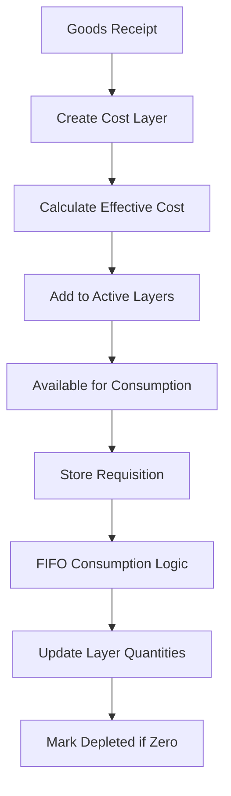

# Functional Requirements Document
## FIFO (First-In-First-Out) Costing Method
### Hotel Inventory Management System

**Document Version**: 1.0  
**Date**: 2024  
**Status**: Draft

---

## Table of Contents

1. [Introduction](#1-introduction)
2. [Functional Overview](#2-functional-overview)
3. [Core FIFO Requirements](#3-core-fifo-requirements)
4. [Cost Layer Management](#4-cost-layer-management)
5. [Consumption Processing](#5-consumption-processing)
6. [Integration Requirements](#6-integration-requirements)
7. [Data Requirements](#7-data-requirements)
8. [User Interface Requirements](#8-user-interface-requirements)
9. [Reporting Requirements](#9-reporting-requirements)
10. [Performance Requirements](#10-performance-requirements)
11. [Error Handling Requirements](#11-error-handling-requirements)
12. [Audit and Compliance](#12-audit-and-compliance)

---

## 1. Introduction

### 1.1 Purpose
This document defines the functional requirements for implementing the FIFO (First-In-First-Out) costing method in the Hotel Inventory Management System. FIFO ensures that the oldest inventory is consumed first, maintaining accurate cost tracking for hospitality operations.

### 1.2 Scope
These requirements cover:
- FIFO cost layer creation and management
- Consumption calculation algorithms
- Integration with receipts, transfers, and adjustments
- Cost recalculation for backdated transactions
- Reporting and audit trail requirements

### 1.3 Definitions

| Term | Definition |
|------|------------|
| Cost Layer | A batch of inventory received at a specific cost |
| Layer Date | The date when inventory was received |
| Consumption | The process of issuing inventory using FIFO logic |
| Effective Cost | The calculated cost after including FOC and extra costs |
| Active Layer | A cost layer with available inventory |
| Depleted Layer | A cost layer with zero available inventory |

---

## 2. Functional Overview

### 2.1 FIFO Process Flow



### 2.2 Key Business Rules Applied

- **BR-001**: Each location maintains independent FIFO layers
- **BR-003**: All movements require lot tracking
- **BR-007**: Backdating triggers automatic recalculation
- **FIFO-001**: Oldest inventory consumed first based on receipt date
- **FIFO-005**: Cost determined at consumption time

---

## 3. Core FIFO Requirements

### 3.1 FIFO Configuration

**FR-FIFO-001**: System Configuration
- The system SHALL allow configuration of FIFO costing method at the location level
- The system SHALL NOT allow mixed costing methods within a single location
- The system SHALL maintain FIFO configuration in the location master

**FR-FIFO-002**: Product Eligibility
- The system SHALL apply FIFO to all inventory-tracked products
- The system SHALL support both direct purchase and manufactured items
- The system SHALL handle unit of measure conversions within FIFO logic

### 3.2 FIFO Processing Rules

**FR-FIFO-003**: Consumption Sequence
- The system SHALL consume inventory in strict date order (oldest first)
- The system SHALL use receipt timestamp for same-date ordering
- The system SHALL allow partial layer consumption

**FR-FIFO-004**: Cost Determination
- The system SHALL calculate cost at the time of consumption
- The system SHALL maintain cost accuracy to 4 decimal places
- The system SHALL round final costs to 2 decimal places for accounting

---

## 4. Cost Layer Management

### 4.1 Layer Creation

**FR-LAYER-001**: Layer Generation
- The system SHALL create a new cost layer for each receipt transaction:
  - Goods Received Note (GRN)
  - Stock In adjustment
  - Transfer In receipt
  - Credit Note return
- Each layer SHALL have a unique identifier (lot number)

**FR-LAYER-002**: Layer Attributes
Required fields for each cost layer:
- Layer ID (UUID)
- Product ID
- Location ID
- Lot Number
- Receipt Date/Time
- Original Quantity
- Available Quantity
- Base Unit Cost
- FOC Quantity
- Allocated Extra Cost
- Effective Unit Cost
- Total Layer Value
- Status (ACTIVE/DEPLETED)
- Source Document Type
- Source Document ID

### 4.2 FOC and Extra Cost Handling

**FR-LAYER-003**: FOC Processing
- The system SHALL average FOC quantities into the batch cost
- Calculation: Effective Cost = Total Paid Amount / (Paid Qty + FOC Qty)
- The system SHALL NOT create separate zero-cost layers for FOC items

**FR-LAYER-004**: Extra Cost Allocation
- The system SHALL allocate extra costs proportionally by line value
- The system SHALL include allocated costs in the final unit cost
- Supported extra costs:
  - Freight charges
  - Insurance
  - Customs duty
  - Port handling
  - Other landed costs

### 4.3 Layer Status Management

**FR-LAYER-005**: Status Transitions
- The system SHALL maintain layer status as:
  - ACTIVE: Available quantity > 0
  - DEPLETED: Available quantity = 0
- The system SHALL automatically update status on consumption
- The system SHALL retain depleted layers for audit purposes

---

## 5. Consumption Processing

### 5.1 FIFO Consumption Algorithm

**FR-CONSUME-001**: Basic Consumption Logic
```sql
-- Pseudocode for FIFO consumption
1. Identify active layers ordered by receipt date
2. For requested quantity:
   a. Consume from oldest layer
   b. If layer insufficient, consume entire layer
   c. Move to next oldest layer
   d. Repeat until quantity fulfilled
3. Update layer quantities
4. Calculate weighted average cost for transaction
5. Mark depleted layers
```

**FR-CONSUME-002**: Multi-Layer Consumption
- The system SHALL support consumption across multiple layers
- The system SHALL track individual layer consumption details
- The system SHALL calculate weighted average cost for the transaction

### 5.2 Consumption Scenarios

**FR-CONSUME-003**: Supported Consumption Types
- Store Requisition
- Transfer Out
- Stock Out adjustment
- Sales/POS consumption
- Manufacturing/Recipe consumption
- Wastage/Spoilage

**FR-CONSUME-004**: Consumption Validation
- The system SHALL validate sufficient inventory before consumption
- The system SHALL check layer availability in real-time
- The system SHALL prevent negative inventory unless overridden

### 5.3 Cost Calculation

**FR-CONSUME-005**: Transaction Costing
- The system SHALL calculate total cost as sum of (quantity × unit cost) per layer
- The system SHALL store both detailed and summary costs
- The system SHALL maintain cost audit trail

---

## 6. Integration Requirements

### 6.1 Receipt Integration

**FR-INTEG-001**: GRN Integration
- The system SHALL create cost layers from approved GRNs
- The system SHALL process FOC quantities from GRN
- The system SHALL apply extra costs from GRN

**FR-INTEG-002**: Transfer Integration
- The system SHALL create layers from transfer receipts
- The system SHALL maintain source location cost basis
- The system SHALL handle in-transit inventory

### 6.2 Period Management Integration

**FR-INTEG-003**: Period Closure
- The system SHALL finalize FIFO costs before period closure
- The system SHALL prevent modifications to closed period layers
- The system SHALL support soft-close adjustments

**FR-INTEG-004**: Backdating Support
- The system SHALL recalculate FIFO costs when transactions are backdated
- The system SHALL maintain before/after cost comparison
- The system SHALL update all affected downstream transactions

### 6.3 Stock Take Integration

**FR-INTEG-005**: Inventory Adjustments
- The system SHALL create adjustment layers for positive variances
- The system SHALL consume using FIFO for negative variances
- The system SHALL use current FIFO cost for adjustments

---

## 7. Data Requirements

### 7.1 Database Schema

**FR-DATA-001**: Cost Layer Table
```sql
tb_inventory_cost_layer:
- id (UUID, PK)
- product_id (UUID, FK)
- location_id (UUID, FK)
- lot_no (VARCHAR)
- layer_date (TIMESTAMP)
- source_doc_type (ENUM)
- source_doc_id (UUID)
- original_qty (DECIMAL)
- available_qty (DECIMAL)
- consumed_qty (DECIMAL)
- base_unit_cost (DECIMAL)
- foc_qty (DECIMAL)
- allocated_extra_cost (DECIMAL)
- final_unit_cost (DECIMAL)
- total_layer_cost (DECIMAL)
- status (ENUM)
- created_at (TIMESTAMP)
- updated_at (TIMESTAMP)
```

**FR-DATA-002**: Consumption Detail Table
```sql
tb_fifo_consumption_detail:
- id (UUID, PK)
- transaction_id (UUID, FK)
- layer_id (UUID, FK)
- consumed_qty (DECIMAL)
- unit_cost (DECIMAL)
- total_cost (DECIMAL)
- consumption_date (TIMESTAMP)
```

### 7.2 Data Retention

**FR-DATA-003**: Historical Data
- The system SHALL retain all cost layers indefinitely
- The system SHALL maintain consumption history for 7 years
- The system SHALL archive depleted layers after 1 year

---

## 8. User Interface Requirements

### 8.1 Layer Visibility

**FR-UI-001**: Cost Layer View
- The system SHALL display active layers for each product/location
- Display columns:
  - Lot Number
  - Receipt Date
  - Available Quantity
  - Unit Cost
  - Total Value
  - Age (days)

**FR-UI-002**: Consumption Preview
- The system SHALL show FIFO simulation before confirming consumption
- Display which layers will be consumed
- Show calculated transaction cost

### 8.2 Management Screens

**FR-UI-003**: FIFO Dashboard
- Current inventory value by FIFO
- Layer aging analysis
- Cost trend visualization
- Consumption patterns

**FR-UI-004**: Layer Management
- View all layers (active/depleted)
- Filter by product, location, date range
- Export layer details

---

## 9. Reporting Requirements

### 9.1 Operational Reports

**FR-REPORT-001**: FIFO Valuation Report
- The system SHALL generate FIFO inventory valuation reports
- Report elements:
  - Product-wise FIFO value
  - Location-wise summary
  - Layer aging analysis
  - Total inventory value

**FR-REPORT-002**: Consumption Report
- The system SHALL provide detailed consumption reports showing:
  - Layers consumed per transaction
  - Cost breakdown
  - Quantity and value summary

### 9.2 Audit Reports

**FR-REPORT-003**: Layer Movement Report
- The system SHALL track all layer movements
- Include receipts, consumptions, adjustments
- Show before/after quantities and values

**FR-REPORT-004**: Cost Variance Report
- The system SHALL identify cost variations between layers
- Highlight unusual cost changes
- Compare period-over-period costs

### 9.3 Analytics

**FR-REPORT-005**: FIFO Analytics
- Layer turnover rates
- Average holding period
- Cost trend analysis
- Dead stock identification

---

## 10. Performance Requirements

### 10.1 Processing Speed

**FR-PERF-001**: Real-time Processing
- FIFO consumption calculation SHALL complete within 2 seconds
- Layer creation SHALL be instantaneous (<100ms)
- Bulk consumption SHALL process 100 items within 10 seconds

**FR-PERF-002**: Concurrent Access
- The system SHALL support 50 concurrent FIFO operations
- The system SHALL implement optimistic locking for layers
- The system SHALL queue consumption requests if needed

### 10.2 Scalability

**FR-PERF-003**: Data Volume
- The system SHALL handle 10,000+ active layers per location
- The system SHALL maintain performance with 1M+ historical layers
- The system SHALL support 10,000+ daily transactions

---

## 11. Error Handling Requirements

### 11.1 Validation Errors

**FR-ERROR-001**: Insufficient Inventory
- The system SHALL clearly indicate when inventory is insufficient
- Display required quantity vs available quantity
- Provide option for partial fulfillment or override

**FR-ERROR-002**: Data Integrity
- The system SHALL validate layer data consistency
- Detect and prevent duplicate layer creation
- Alert on data corruption or inconsistencies

### 11.2 Recovery Procedures

**FR-ERROR-003**: Transaction Rollback
- The system SHALL support transaction rollback on errors
- Restore layer quantities to pre-transaction state
- Maintain audit log of rollback actions

**FR-ERROR-004**: Recalculation Recovery
- The system SHALL handle recalculation failures gracefully
- Provide detailed error logs
- Allow manual intervention if needed

---

## 12. Audit and Compliance

### 12.1 Audit Trail

**FR-AUDIT-001**: Comprehensive Logging
- The system SHALL log all layer creation events
- The system SHALL log all consumption transactions
- The system SHALL log all cost modifications
- Required audit fields:
  - Transaction ID
  - User ID
  - Timestamp
  - Before/After values
  - Reason for change

**FR-AUDIT-002**: Cost Change Tracking
- The system SHALL maintain history of cost changes
- Track backdated entry impacts
- Document recalculation results

### 12.2 Compliance Features

**FR-AUDIT-003**: Regulatory Compliance
- The system SHALL support lot traceability
- The system SHALL maintain batch/expiry tracking
- The system SHALL provide FIFO certification reports

**FR-AUDIT-004**: Internal Controls
- The system SHALL enforce approval workflows for adjustments
- The system SHALL prevent unauthorized cost modifications
- The system SHALL support period lock controls

---

## 13. Acceptance Criteria

### 13.1 Functional Testing

| Test Case | Acceptance Criteria |
|-----------|-------------------|
| Layer Creation | New layer created for each receipt with correct cost calculation |
| FOC Processing | FOC quantities correctly averaged into unit cost |
| FIFO Consumption | Oldest layers consumed first in correct sequence |
| Multi-layer Consumption | Correctly consumes across multiple layers with accurate costing |
| Backdating | Triggers recalculation and updates affected transactions |
| Period Closure | FIFO costs finalized and locked after period close |

### 13.2 Performance Testing

| Metric | Target | Acceptance Criteria |
|--------|--------|-------------------|
| Consumption Calculation | <2 seconds | 95% of transactions |
| Layer Creation | <100ms | 99% of transactions |
| Report Generation | <30 seconds | For 10,000 records |
| Concurrent Users | 50 | No performance degradation |

---

## 14. Dependencies

### 14.1 System Dependencies
- Product Master module
- Location Master module
- GRN Processing module
- Period Management module
- Approval Workflow engine

### 14.2 External Dependencies
- Database system with transaction support
- Message queue for asynchronous processing
- Reporting engine for complex reports

---

## 15. Assumptions and Constraints

### 15.1 Assumptions
- Each location operates independently
- System date/time is synchronized across servers
- Users are trained on FIFO concepts
- Historical data migration completed before go-live

### 15.2 Constraints
- Cannot change costing method mid-period
- Cannot modify closed period transactions
- Maximum 999 layers per consumption transaction
- Decimal precision limited to 4 places for calculations

---

## Appendix A: Sample Calculations

### A.1 Simple FIFO Consumption
```
Available Layers:
Layer 1: 100 units @ $10 = $1,000
Layer 2: 150 units @ $12 = $1,800

Consumption: 120 units
From Layer 1: 100 @ $10 = $1,000
From Layer 2: 20 @ $12 = $240
Total Cost: $1,240
Average: $10.33/unit
```

### A.2 FOC Cost Calculation
```
Purchase: 100 units @ $5 = $500
FOC: 25 units (free)
Total Quantity: 125 units
Effective Cost: $500 / 125 = $4.00/unit
```

### A.3 Extra Cost Allocation
```
Product A: $1,000 (40% of total)
Product B: $1,500 (60% of total)
Extra Cost: $500

Product A allocation: $500 × 40% = $200
Product B allocation: $500 × 60% = $300
```

---

## Appendix B: Error Messages

| Code | Message | Resolution |
|------|---------|------------|
| FIFO-E001 | Insufficient inventory for FIFO consumption | Check available layers or request override |
| FIFO-E002 | No active layers found | Verify receipts exist for product/location |
| FIFO-E003 | Cost calculation failed | Review layer data integrity |
| FIFO-E004 | Period is locked for modifications | Request audit adjustment approval |
| FIFO-E005 | Backdating exceeds allowed period | Check backdating rules and limits |

---

## Document Control

| Version | Date | Author | Changes |
|---------|------|--------|---------|
| 1.0 | 2024 | System Analyst | Initial version |

---

**END OF DOCUMENT**